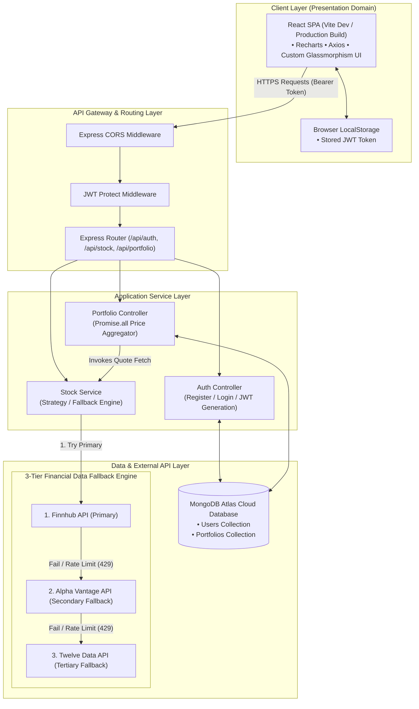
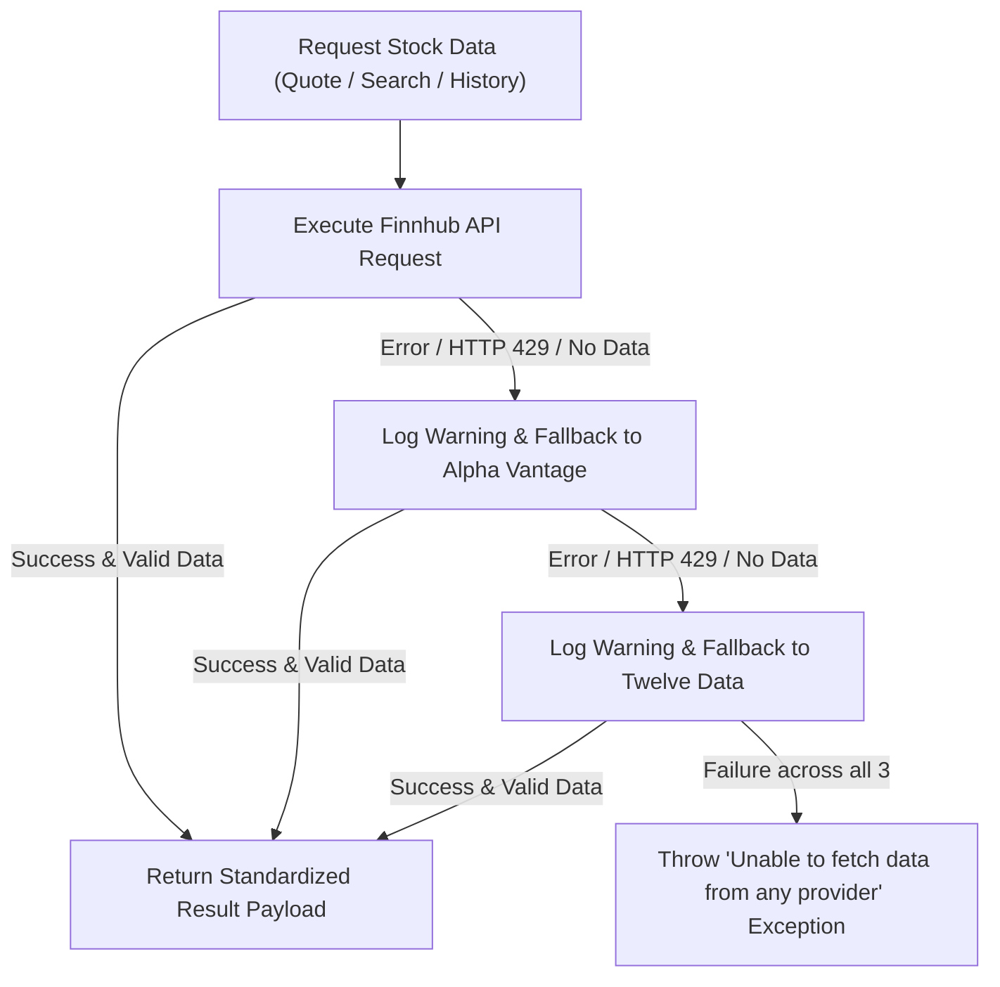
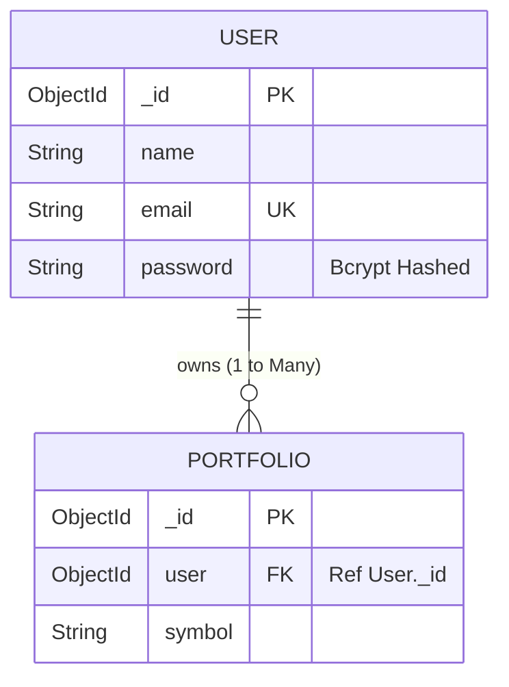
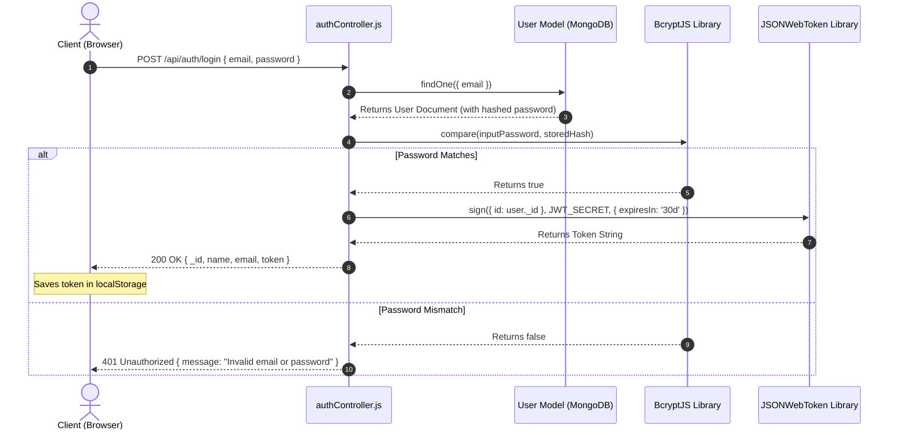
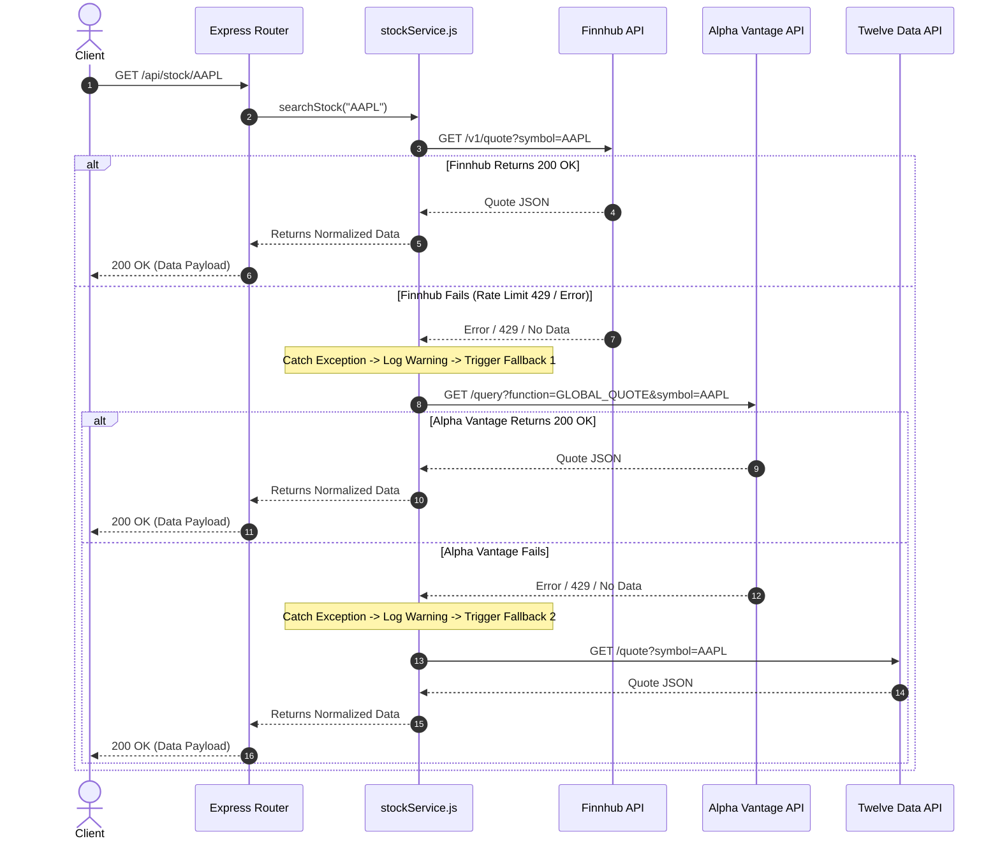
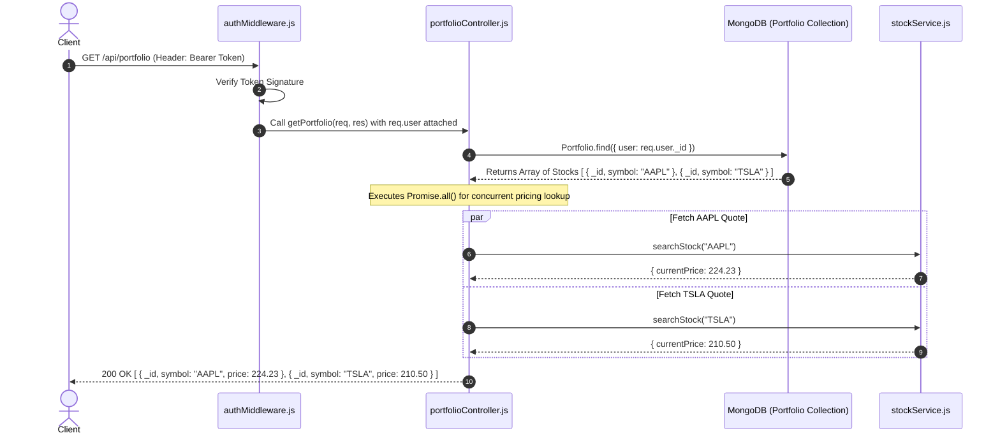

# Stock Analyzer: High-Level (HLD) & Low-Level Design (LLD) Guide for Interviews

This document provides a comprehensive, interview-ready System Design breakdown for **Stock Analyzer** — a decoupled MERN-stack financial tracking dashboard featuring a multi-provider fallback engine, JWT-based authentication, interactive trend visualization, and containerized deployment.

---

## Executive Summary & Quick Specs

| Spec | Details |
| :--- | :--- |
| **System Architecture** | Decoupled Client-Server MERN Architecture |
| **Frontend Stack** | React (Vite), Recharts, Axios, Vanilla CSS (Glassmorphism) |
| **Backend Stack** | Node.js, Express.js, Mongoose ODM |
| **Database** | MongoDB Atlas (Cloud Document Store) |
| **Authentication** | Stateless JWT (Bearer Scheme) + BcryptJS Password Hashing |
| **External Providers** | Finnhub → Alpha Vantage → Twelve Data (Automatic 3-Tier Fallback Engine) |
| **Containerization** | Docker, Docker Compose (Client, Server, Mongo) |
| **Deployment Target** | Vercel (Client SPA) + Render (Express API) + MongoDB Atlas |

---

# PART 1: HIGH-LEVEL DESIGN (HLD)

---

## 1.1 Requirements & System Scope

### Functional Requirements (FR)
1. **User Authentication & Session Management**: Users can register and log in securely. Sessions are stateless and authenticated via JSON Web Tokens (JWT).
2. **Live Ticker Autocomplete**: Users can search for stocks dynamically as they type, returning symbol recommendations from global exchanges.
3. **Stock Quote Lookup & Metrics**: Users can query real-time stock valuation metrics (Current Price, Open, High, Low, Previous Close, Volume).
4. **Historical Trend Visualization**: Users can view 30-day historical closing price charts generated interactively via SVG charts.
5. **Personalized Watchlist / Portfolio Management**: Authenticated users can save tickers to their personal portfolio, view live aggregated valuations, and remove saved items.
6. **High Availability Data Fetching**: The system transparently fetches financial data across multiple third-party providers if primary services fail or hit rate limits.

### Non-Functional Requirements (NFR)
1. **High Availability & Fault Tolerance**: 99.9% uptime target for stock metrics despite third-party API rate limits or IP restrictions.
2. **Low Latency**: Search suggestions and quote responses returned in $<200\text{ ms}$.
3. **Stateless Scalability**: The backend Node.js API must be completely stateless to enable horizontal auto-scaling behind load balancers.
4. **Data Consistency**: Eventual consistency for market data, strong consistency for user portfolio persistence.
5. **Security**: Zero plaintext password storage (salted bcrypt), token expiration (30 days), CORS protection, and HTTP request authorization headers.

---

## 1.2 High-Level Architecture Diagram



---

## 1.3 System Component Breakdown

### 1. Client SPA (React + Vite)
- **Role**: Single Page Application (SPA) handling view rendering, state management, client-side routing (`react-router-dom`), and asynchronous HTTP communications via Axios.
- **Security Context**: Extracts JWT tokens from `localStorage` and appends them into the standard HTTP `Authorization: Bearer <token>` header.

### 2. Express API Gateway & Middleware
- **Role**: Acts as the central controller receiving incoming client requests.
- **CORS Handler**: Ensures requests strictly originate from authorized domains (e.g., localhost during development or Vercel domain in production).
- **JWT Protection Middleware**: Decodes and verifies the signature of incoming JWT tokens using `process.env.JWT_SECRET`, extracting the payload `id` and fetching the sanitized user record.

### 3. Application Controllers & Services
- **Auth Controller**: Validates input credentials, hashes passwords via `bcryptjs`, issues signed 30-day JWT tokens.
- **Stock Service (Multi-Provider Engine)**: Implements fallback logic to query stock quote, search suggestion, and historical chart endpoints.
- **Portfolio Controller**: Manages user-specific stock mappings. When fetching a user's portfolio, it retrieves database records and asynchronously aggregates live quotes for all saved stocks in parallel (`Promise.all`).

### 4. Data Layer (MongoDB Atlas Cloud)
- **Role**: Persistence layer storing document models for users and portfolio relationships.
- **Driver**: `mongoose` ODM handling database connections, schema validation, and middleware hooks (`pre('save')` password hashing).

---

## 1.4 Resilience & High Availability (The Multi-Provider Fallback Engine)

A critical architectural highlight of Stock Analyzer is its **Multi-Provider Fallback Strategy**. 

Third-party financial APIs on free tiers impose strict rate limits (e.g., Finnhub 60 req/min, Alpha Vantage 5 req/min, Twelve Data 8 req/min) or IP restrictions on cloud hosting platforms like Render.

### Fallback Execution Chain



### Standardized Normalized Output Schema
Regardless of which external API succeeds (Finnhub, Alpha Vantage, or Twelve Data), the service normalizes the response into a unified payload for the client:
```json
{
  "symbol": "AAPL",
  "companyName": "Apple Inc.",
  "currentPrice": 224.23,
  "currency": "USD",
  "exchange": "NASDAQ",
  "marketState": "ACTIVE",
  "previousClose": 222.50,
  "open": 223.00,
  "high": 225.10,
  "low": 222.10,
  "volume": 48210340
}
```

---

## 1.5 Containerization Topology (Docker Compose)

The repository provides full containerization for local development and integration testing via a 3-container Docker Compose setup:

```
docker-compose.yml
 ├── client   (React + Vite dev server)  → Port 5173
 ├── server   (Node.js + Express API)    → Port 5000
 └── mongo    (MongoDB Container)        → Port 27017
```

- **Inter-container Networking**: Service discovery is managed via Docker's internal DNS network. The React dev proxy routes `/api` requests to `http://server:5000`.

---

## 1.6 Interview Tradeoff Analysis & Scaling Strategies

| Tradeoff Decision | Selected Approach | Alternative Considered | Interview Justification |
| :--- | :--- | :--- | :--- |
| **Database Type** | **MongoDB (NoSQL)** | PostgreSQL (RDBMS) | Portfolio items and user documents are loosely coupled. MongoDB allows rapid schema iteration without costly migration locks during rapid feature development. |
| **Authentication** | **Stateless JWT** | Stateful Server Sessions (Redis/Express-Session) | Stateless JWTs allow horizontal scaling of the API gateway across multiple Node instances without shared session state. |
| **Real-time Protocol** | **HTTP REST / Polling** | WebSockets (Socket.io) | REST with multi-provider fallback provides simpler infrastructure management and lower server overhead for stock quote updates on demand. |
| **Caching Layer** | **Direct Provider Chain** | Redis In-Memory Cache | Adding Redis (TTL 60s for quotes, 24h for historical) would reduce external API calls by >80%. (Great talking point for system design interviews!). |

---

# PART 2: LOW-LEVEL DESIGN (LLD)

---

## 2.1 Database Schemas & Data Modeling

### 1. User Entity Schema (`models/User.js`)
```javascript
const userSchema = new mongoose.Schema({
    name: {
        type: String,
        required: true
    },
    email: {
        type: String,
        required: true,
        unique: true
    },
    password: {
        type: String,
        required: true
    }
});
```

### 2. Portfolio Entity Schema (`models/Portfolio.js`)
```javascript
const portfolioSchema = new mongoose.Schema({
    user: {
        type: mongoose.Schema.Types.ObjectId,
        ref: 'User',
        required: true
    },
    symbol: {
        type: String,
        required: true
    }
});
```

### Entity Relationship Diagram (ERD)



### Indexing Strategy
- `email`: Unique index on `User.email` for $O(1)$ user login query speed.
- `user + symbol`: Recommended compound unique index on `Portfolio` schema `{ user: 1, symbol: 1 }` to enforce idempotency and prevent duplicate watchlist entries.

---

## 2.2 API Specifications & Contracts

### 1. Authentication Endpoints

#### `POST /api/auth/register`
- **Request Headers**: `Content-Type: application/json`
- **Request Body**:
  ```json
  {
    "name": "John Doe",
    "email": "john@example.com",
    "password": "SecurePassword123"
  }
  ```
- **Response `201 Created`**:
  ```json
  {
    "_id": "66ae8f12a3b4c5d6e7f8a9b0",
    "name": "John Doe",
    "email": "john@example.com",
    "token": "eyJhbGciOiJIUzI1NiIsInR5cCI6IkXVCJ9..."
  }
  ```
- **Error Responses**: `400 Bad Request` ("User already exists"), `500 Internal Server Error`.

#### `POST /api/auth/login`
- **Request Body**:
  ```json
  {
    "email": "john@example.com",
    "password": "SecurePassword123"
  }
  ```
- **Response `200 OK`**: Same as registration payload (returns user details + JWT token).
- **Error Responses**: `401 Unauthorized` ("Invalid email or password").

---

### 2. Stock Financial Endpoints

#### `GET /api/stock/suggestions/search?q=:query`
- **Query Parameter**: `q` (e.g., `AAPL` or `Apple`)
- **Response `200 OK`**:
  ```json
  [
    { "symbol": "AAPL", "shortname": "Apple Inc.", "exchDisp": "NASDAQ" },
    { "symbol": "AAPL.ARG", "shortname": "Apple Inc.", "exchDisp": "BCBA" }
  ]
  ```

#### `GET /api/stock/:symbol`
- **Path Parameter**: `symbol` (e.g., `TSLA`)
- **Response `200 OK`**: Returns normalized quote object.

#### `GET /api/stock/:symbol/history`
- **Path Parameter**: `symbol` (e.g., `NVDA`)
- **Response `200 OK`**:
  ```json
  [
    { "date": "2026-07-01", "close": 122.50 },
    { "date": "2026-07-02", "close": 124.10 }
  ]
  ```

---

### 3. Portfolio Endpoints (JWT Protected)

#### `GET /api/portfolio`
- **Request Headers**: `Authorization: Bearer <JWT_TOKEN>`
- **Response `200 OK`**:
  ```json
  [
    {
      "_id": "66ae9110b4c5d6e7f8a9b0c1",
      "user": "66ae8f12a3b4c5d6e7f8a9b0",
      "symbol": "AAPL",
      "price": 224.23
    }
  ]
  ```

#### `POST /api/portfolio/add`
- **Request Headers**: `Authorization: Bearer <JWT_TOKEN>`
- **Request Body**: `{ "symbol": "MSFT" }`
- **Response `201 Created`**: Returns saved database item.

#### `DELETE /api/portfolio/:id`
- **Request Headers**: `Authorization: Bearer <JWT_TOKEN>`
- **Path Parameter**: `id` (Portfolio Mongo `_id`)
- **Response `200 OK`**: `{ "message": "Stock removed" }`

---

## 2.3 Object-Oriented Architecture & Software Design Patterns

### Pattern 1: Chain of Responsibility / Fallback Strategy
In `services/stockService.js`, the fallback mechanism implements a behavioral chain:

```javascript
async function searchStock(symbol) {
    try {
        return await searchStockFinnhub(symbol);
    } catch (error) {
        console.log('Finnhub quote failed, trying Alpha Vantage');
        try {
            return await searchStockAlphaVantage(symbol);
        } catch (fallbackError) {
            console.log('Alpha Vantage quote failed, trying Twelve Data');
            try {
                return await searchStockTwelveData(symbol);
            } catch (twelveError) {
                throw new Error("Unable to fetch stock data from any provider.");
            }
        }
    }
}
```

### Pattern 2: Middleware Interceptor Pattern
The authentication pipeline enforces declarative route protection via Express middleware (`middleware/authMiddleware.js`):

```javascript
const protect = async function (req, res, next) {
    let token;
    if (req.headers.authorization && req.headers.authorization.startsWith('Bearer')) {
        try {
            token = req.headers.authorization.split(' ')[1];
            const decoded = jwt.verify(token, process.env.JWT_SECRET);
            req.user = await User.findById(decoded.id).select('-password');
            return next();
        } catch (error) {
            return res.status(401).json({ message: 'Not authorized, token failed' });
        }
    }
    if (!token) return res.status(401).json({ message: 'Not authorized, no token provided' });
};
```

---

## 2.4 Detailed Sequence Diagrams

### Sequence Diagram 1: User Authentication Flow



---

### Sequence Diagram 2: Multi-Provider Stock Quote Failover Flow



---

### Sequence Diagram 3: Portfolio Retrieval & Live Pricing Aggregation Flow



---

# PART 3: TOP INTERVIEW QUESTIONS & ANSWERS

### Q1: How does your system handle 3rd party API rate limits and failures?
> **Answer**: We engineered a **3-tier Fallback Engine** (`stockService.js`). Requests try **Finnhub** first. If Finnhub fails due to a `429 Too Many Requests`, timeout, or network error, a `try-catch` block catches the exception and immediately attempts **Alpha Vantage**, followed by **Twelve Data**. All responses are mapped to a single normalized payload, keeping the client codebase decoupled from provider-specific data schemas.

---

### Q2: Why did you use `Promise.all` when returning the user's portfolio?
> **Answer**: In `portfolioController.js`, a user can have multiple saved stocks. Rather than sequentially `await`-ing each stock quote lookup in a loop (which would cause linear latency multiplier $O(N)$), `Promise.all` triggers all stock quote fetches concurrently. This reduces total response latency to the speed of the single slowest stock lookup ($O(1)$ network execution time relative to array size).

---

### Q3: How do you handle password security and user authentication?
> **Answer**: Passwords are never stored in plaintext. We use `bcryptjs` with a salt factor of 10 inside a Mongoose `pre('save')` schema hook. During login, passwords are verified using timing-safe hash comparison (`bcrypt.compare`). Session state is managed via stateless JWTs containing user ID claims, signed by a secret key with a 30-day expiration window.

---

### Q4: How would you scale this application to support 1 Million Daily Active Users (DAU)?
> **Answer**:
> 1. **Add Redis Caching**: Cache stock quotes with a 15-60 second TTL. Stock price quotes don't change every millisecond for retail users. A cache layer would absorb >95% of incoming quote requests, drastically reducing external API usage and database queries.
> 2. **Implement WebSockets / SSE**: Replace client HTTP polling with WebSocket connections for active dashboard viewers to push live price deltas.
> 3. **Horizontal API Scaling**: Run stateless Node.js container instances behind an AWS ALB (Application Load Balancer) or NGINX reverse proxy.
> 4. **Read Replicas for MongoDB**: Use MongoDB replica sets to separate read operations (portfolio listing) from write operations (adding/removing stocks).

---

### Q5: What coding standards were adopted in this project?
> **Answer**: 
> 1. **Strictly Named Functions**: Arrow functions (`=>`) were avoided in favor of explicit `function name()` declarations. This improves call stack readability during debugging and stack trace analysis.
> 2. **Decoupled Architecture**: Clear separation of concerns into Controllers, Models, Routes, Services, and Middleware.
